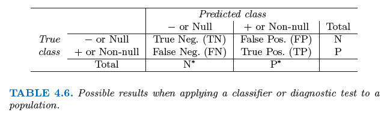
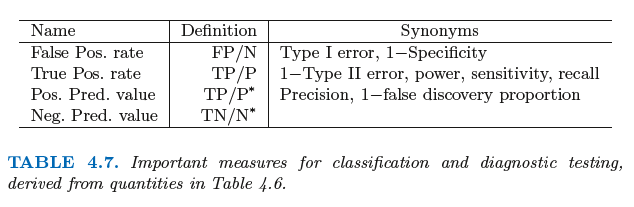
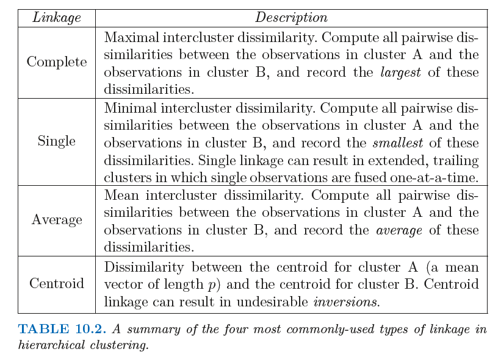

### Errors and correct conclusions in hypothesis testing
|             -       | $H_0$ True                    | $H_a$ True             |
|---------------------|-------------------------------|----------------------|
| Do not reject $H_0$ | Correct conclusion   | Type II error `false negative` |
| Reject $H_0$        | Type I error `false positive` | Correct conclusion   |


### $p$-VALUE

A $p$-value is a probability that provides a measure of the evidence against the null hypothesis $H_0$ provided by the sample. Smaller $p$-values indicate more evidence against $H_0$.

**Reject rule:** Reject $H_0$ if $p$-value $\leq a,$

where $a$ is the level of significance.

### Confusion Matrix
  

> Source: [Intro to Stat Learning, Tibshirani et al](www-bcf.usc.edu/~gareth/ISL/)


#### Ways to create confusion matrix with Code

```
# 1)
cm = pd.DataFrame({'True class': y.iloc[:,1],
                    'Predicted class': preds.iloc[:,0] > 0.5})
cm.replace(to_replace={0:'Down', 1:'Up'}, inplace=True)
cm.groupby(['Predicted class', 'True class']).size().unstack('True class')

# 2)
cm = pd.DataFrame(confusion_matrix(y_test, y_preds).T, index=['CH', 'MM'], columns=['CH', 'MM'])
cm.index.name = 'Predicted'
cm.columns.name = 'True'

# 3)
pd.DataFrame(confusion_matrix(y_test, y_pred), index=svc.classes_, columns=svc.classes_)
```


### Getting index of a minimum value in an iterable

```
# 1)
all_mse.index(min(all_mse))

# 2)
min(range(len(all_mse)), key=all_mse.__getitem__)

# 3)
from operator import itemgetter
min_index, min_val = min(enumerate(all_mse), key=itemgetter(0))
```

### Getting a specific metric from an iterable of `models`

```
# e.g. getting R2 with either list comprehension or lambda function
r_adj = [models.iloc[x, 0].rsquared_adj for x in range(len(models))]
rsquared_adj = models.apply(lambda row: row[0].rsquared_adj, axis=1)

```

### Dealing with features sets

```
# creating feature space
X = college[college.columns.difference(['Apps'])]
X = college.drop('Apps', axis=1)

# converting a response into binary
auto['mpg'].map(lambda x: 1 if x > median_mpg else 0) 
auto['mpg01'] = np.where(auto['mpg'] > median_mpg, 1, 0)
```

### Types of linkage in heirarchical clustering




### Proportion of Variance Explained (PVE)
> Page 383, Equation 10.8

In **PCA**, the PVE for the $m$th principal component is give by

$$\dfrac{\sum_{i=1}^n \left( \sum_{j=1}^p \phi_{jm}x_{ij} \right)^2}{\sum_{j=1}^p \sum_{i=1}^n x_{ij}^2}$$

where $\phi_{jm}$ are the *loadings* of the principal components. The PVE measures how much of the variance in the data is *not* contained in the first few principal components.

#### **Implementation in code:**
The `pca` is a fitted instance of Sklearn's `PCA()`.
```
for k in range(0,np.shape(pca.components_)[1]):
    # Numerator
    accum = 0
    num = 0
    for i in range(0, np.shape(df_scl)[0]):
        for j in range(0, np.shape(df_scl)[1]):
            accum += pca.components_[k][j] * df_scl[i][j]
        num += accum**2
        accum = 0

    # Denominator
    accum = 0
    den = 0
    for j in range(0, np.shape(df_scl)[1]):
        for i in range(0, np.shape(df_scl)[0]):
            accum += df_scl[i][j]**2
        den += accum
        accum = 0

    # Result
    print('principal component number:', k+1)
    print(num/den)
```